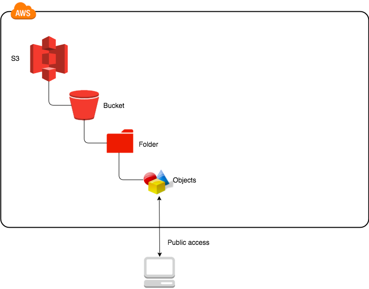
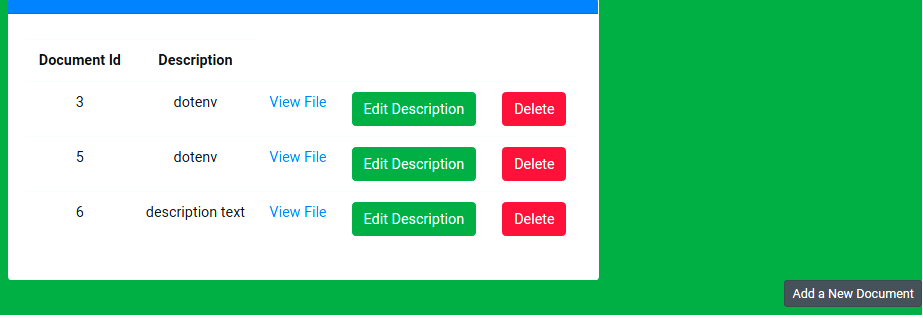
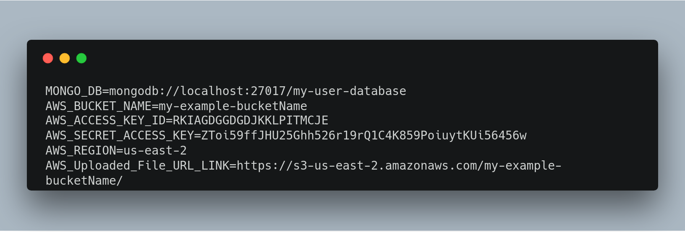

The source code for my **[Medium Blog](https://medium.com/@paulrohan/file-upload-to-aws-s3-bucket-in-a-node-react-mongo-app-and-using-multer-72884322aada)**

A simple boilerplate project to implement AWS S3 file upload functionality in a Node, React and Mongo app. Using Multer for uploading file.

The `master` branch has the code for AWS-S3 upload and the `disk-storage` branch has the working app for uploading file to the project root at the disk with no AWS-s3 connection.

### To launch this project in the local machine

First start mongodb service with `sudo service mongod start` and then the following commands

-   Run `npm install`
-   Run `npm run dev`
-   Run `npm start`

It will start the server at [http://localhost:3000/](http://localhost:3000/)

### Most importantly remember to replace AWS S3's bucket_name, AWSAccessKeyId and AWSSecretKey wth your own. I have kept those keys of mine in the .env file in the project root, and which ofcourse have been put in the gitignore file so not be make them public.





This project was bootstrapped with [Create React App](https://github.com/facebook/create-react-app).

### Example .env file (WHICH MUST NEVER BE PUSHED TO ANY PUBLIC REPOSITORY LIKE GITHUB )



## ALWAYS PUT THIS .env FILE IN THE .gitignore FILE

### How to make the AWS-S3 bucket public - whithout which the upload will NOT work

If you're using an Amazon S3 bucket to share files with anyone else, you'll first need to make those files public. Maybe you're sending download links to someone, or perhaps you're using S3 for static files for your website or as a content delivery network (CDN). But if you don't make the files public, your users will get an XML error message saying the file is unavailable.

1. Sign in to Amazon Web Services and go to your S3 Management Console.

2. Select the bucket from the left. At right, click the Properties button if it's not already expanded.

3. Go to the Permissions tab > Public Access Settings Tab

4. Click on Edit > Then

    A) `Block new public ACLs and uploading public objects (Recommended)` - Make it false (i.e. uncheck it)

    B) `Block new public bucket policies (Recommended)` - Make it false (i.e. uncheck it)

    C) `Block public and cross-account access if bucket has public policies (Recommended)` - Make it false (i.e. uncheck it)

    D) `Block public and cross-account access if bucket has public policies (Recommended)` - Make it false (i.e. uncheck it) - Without this last action, althouh I was able to upload BUT was NOT able to download.

So all the four options that was there (as on 24-Nov-2018) - I made all of them false.

#### I can test the upload API from Postman by selecting `http://localhost:3000/api/document/upload` and > POST > Body > form-data > under Key type "file" and under Value select file and choose a file.

And I will get back a 200 OK response of the below form-data

```js
{
	"data": {
	"ETag": "a number",
	"Location": "full link of the file",
	"key": "original file name of the file that I uploaded",
	"Key": "original file name of the file that I uploaded",
	"Bucket": "my AWS s3 bucket name"
	}
}
```

[Small note on .env file - When putting the value for "AWS_Uploaded_File_URL_LINK" - I have to include a forward slash ("/") after ]

### Bit Time-wasting Issue I faced after changing the AWS credentials - Upload was failing and in Postman was getting below error -

```js
{
    "error": true,
    "Message": {
        "message": "The AWS Access Key Id you provided does not exist in our records.",
        "code": "InvalidAccessKeyId",
        "region": null,
        "time": "2018-12-03T03:35:06.814Z",
        "requestId": "CB10MJLKH';K329221D58F",
        "extendedRequestId": "buSOYR4iBPxaCyNsn3WhggsgkkkUT:"669Y;g;fk;gffLuJe2596PO1464RRw+is7Gg=",
        "statusCode": 403,
        "retryable": false,
        "retryDelay": 5.089012444180119
    }
}
```

The app was taking old `process.env` variable rather than what I set inside the app in the .enf file - 29-Nov-2018

The backend Route for document upload will not take what I was setting up in the .env file rathar was taking from a catch.

So in the backend upload routes .js file I put the `console.log()` code to see what it was throwing.

```js
let s3bucket = new AWS.S3({
	accessKeyId: process.env.AWS_ACCESS_KEY_ID,
	secretAccessKey: process.env.AWS_SECRET_ACCESS_KEY,
	region: process.env.AWS_REGION
});
```

Just below the above code in routes.js file put the below code

```js
console.log(process.env.AWS_BUCKET_NAME);
console.log(process.env.AWS_ACCESS_KEY_ID);
console.log(process.env.AWS_SECRET_ACCESS_KEY);
console.log(process.env.AWS_REGION);
console.log(process.env.AWS_Uploaded_File_URL_LINK);
```

And saw it was taking a completely wrong AWS credentials.

Then first I ran the following commands

`echo $AWS_ACCESS_KEY_ID`

`echo $AWS_SECRET_ACCESS_KEY`

And both will give different credentials than what I have in .env file.

Then I ran the command

`unset AWS_ACCESS_KEY_ID`

`unset AWS_SECRET_ACCESS_KEY`

which was deleting the key and after doing this unset, then running `echo $AWS_ACCESS_KEY_ID` was no more showing the value in the terminal, but as soon as I send a POST request to upload a document with Postman, again, I will get back that wrong key in the Terminal

### Final Solution - Plain old whole full system (my local machine) restart.
